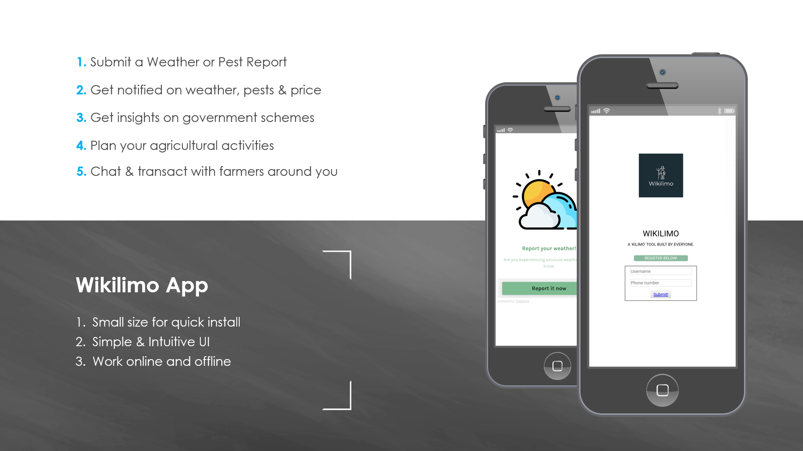

# Wikilimo: A ‘kilimo’ tool built by everyone

[Winning Submission](https://ideas.unite.un.org/openciplatform/Page/ViewIdea?ideaid=1551) for the Unite-Ideas Open Climate Informatics Challenge, 2019.

Wikilimo is an online-offline platform to provide farmers with actionable insights (weather alerts, pest information, market rates, subsidies), P2P chat and agricultural planning from crowd-sourced & expert-backed information.

Sign up for updates and find out more details at [http://wikilimo.co](http://wikilimo.co).



## This repo hosts:

-  The Wikilimo platform source code
-  [Video Demo](https://www.youtube.com/watch?v=cuoEjV3_wAI)
-  [Documentation](Documentation)

## Built with:
<a rel="license" href="https://docs.python.org/3.7/"></a>, <a rel="license" href="https://www.npmjs.com/package/npm/v/6.9.0"></a>, <a rel="license" href="https://nodejs.org/dist/v10.16.0/docs/api/"></a>, <a rel="license" href="https://pypi.org/project/pyowm/2.10.0/"></a>, <a rel="license" href="https://cordova.apache.org/"></a>, [Android Studio](https://developer.android.com/studio/run/emulator), [Firebase](https://firebase.google.com/), [Lucid Chart](https://www.lucidchart.com), [Typeform](https://www.typeform.com/), [Africa’s Talking API](https://africastalking.com/), [Flaticons](www.flaticon.com), [Google Cloud Platform](https://cloud.google.com/), [Open Weather Map API](https://openweathermap.org/), :coffee: and :yellow_heart:.

## User Guide
##### Step 1. To clone this repository, run:
```bash
git clone <this repo>
```


##### Step 2. To run the prototype application on an android device: 
1. Go to security settings and disable Google Play Protect.
2. Download and install the Wikilimo.apk file on the device.


##### Step 3. To explore mobile application source code (currently still in it’s development environment), run:
```bash
cd Wikilimo_mobileapp
```
##### Then, check [this](Wikilimo_mobileapp/README.md) README file for further instructions and a prototype app demo.


##### Step 4. To explore the offline functionality source code, run:
```bash
cd Wikilimo_offline
```
##### Then, check [this](Wikilimo_offline/README.md) README file for further instructions and demos of SMS/USSD services.

Read contributing guidelines [here](https://github.com/wikilimo/Wikilimo/blob/master/Contributing.md).

## Authors

| [](https://github.com/roshni-b/) | [](https://github.com/lazyoracle/)  |
|---------------------------------------------------------------------------------------------------|----------------------------------------------------------------------------------------------|
| [Roshni Biswas](https://github.com/roshni-b)                                                | [Anurag Saha Roy](https://github.com/lazyoracle)                                              | 

## Licenses 
Wikilimo is licensed by <a rel="license" href="http://creativecommons.org/licenses/by-nc-sa/4.0/"></a> as per Unite-Ideas OpenCI Challenge 2019 guidelines.
