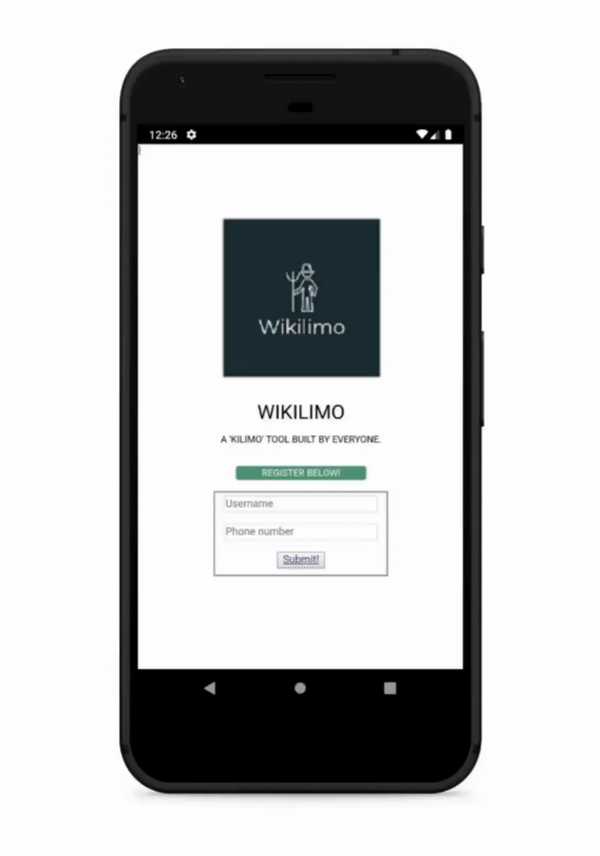
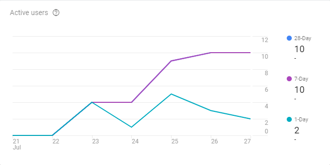
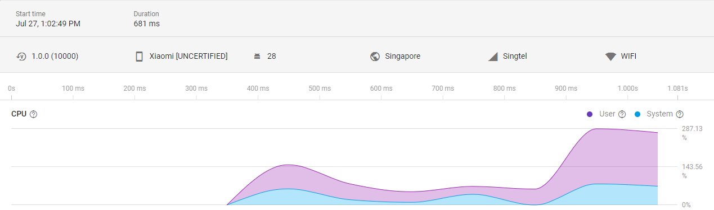

### This directory contains the source code for the Wikilimo platform's mobile application prototype.

## User Guide
1. Download and install Apache Cordova v9.0.0, npm v6.9.0, node v10.16.0 and Android studio.
2. Run `cordova platform add android`
3. Run `cordova run android` to view the deployed app in the emulator.

### Here's a demo:

### Full support for User Analytics
#### Active Users:

  
#### User Sessions:

